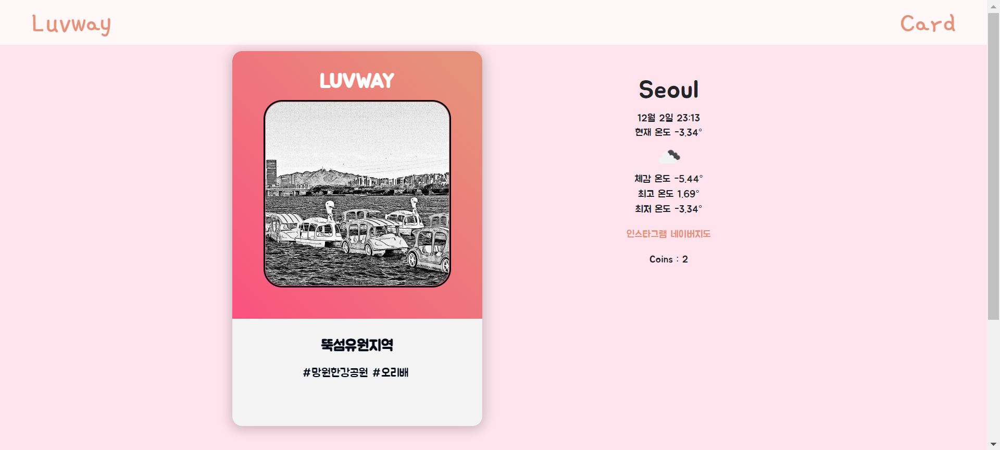

# OSSP_Team13

## App Name
LUVWAY

## Introduction
```
" 오늘은 뭐할까? "
" 새로운 거 하고 싶은데... 어디로 가면 좋을까? "
```

#### 매일 반복되는 데이트 코스로 인해 지루함을 느끼는 연인들에게 랜덤으로 데이트할 *지하철역*을 추천해줍니다.

이름은 들어봤지만 가보지 않은 역부터 누구나 알고 있는 대중적인 역까지! 수도권 데이트 하기 좋은 역으로 골라, 총 33개의 지하철역 카드가 준비되어 있습니다. 

선뜻 가기 망설여졌던 새로운 곳으로 떠나 색다른 데이트를 즐겨보는 것은 어떠신가요?

## How to use

1. 사용자에게 기본으로 5개의 코인이 주어집니다. 
2. LUWAY 페이지에 접속하여 하트가 그려진 카드를 클릭합니다.
- 새로운 카드를 뒤집을 때마다 코인이 하나씩 줄어드니 조심해주세요!
3. 카드가 뒤집히면서, 33개의 지하철역 중 하나의 역이 랜덤으로 나오게 됩니다.
4. 해쉬태그를 통해 지하철역 대표 놀거리, 구경거리를 확인하실 수 있습니다.
5. 인스타그램, 네이버 지도를 클릭하면 해당 링크로 연결되며 추천 지하철역의 즐길거리를 직접 찾아볼 수도 있습니다.
6. 그날의 날씨도 함께 띄워지니 적절한 옷차림과 함께 데이트를 즐겨주시면 됩니다!


# How to test

프로젝트 테스트를 위해서는 node와 npm이 설치되어 있어야 합니다.

express package 사용을 위해 npm을 통해 다운로드합니다.
```
npm install express

or

npm install -g express // global install
```

root 폴더 내의 coin.js를 실행하면 로컬 호스트 서버를 이용할 수 있습니다.
```
node coin.js
```

coin.js에는 로컬 호스트 서버의 port 정보가 담겨 있습니다.
해당 코드를 수정해 port를 변경할 수 있습니다.
```
const port = 3000
```

브라우저에서 localhost:3000을 입력해 테스트 페이지에 접속할 수 있습니다.
```
localhost:3000
```


## Examples
아래에 있는 예시들은 웹페이지를 새로고침 할 때마다 랜덤으로 새로운 카드가 나오는 것을 보여주기 위해 3개의 카드를 뽑았다. 


올림픽공원역


제기동역


뚝섬유원지역


## Screenshots


## Presentation video Youtube link

## Contributing

배포 이전 대부분의 작업은 dev 브랜치로 Pull Request 해주시기 바랍니다.

dev 브랜치에서는 dataset을 포함하지 않습니다.

commit format : "date-initial-count : [message]"
ex) git commit -m "14-Y-0 : fix ~~~"
